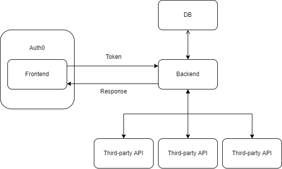

# mock-stock-comp

## Application workflow

1. Using an Auth0 token to validate API calls.
   - Only users with valid permission can get responses.
   - The Auth0 key will contain role information. E.g., User, Admin, etc...
2. Any third-party APIs MUST be called within the backend
   - Because we cannot safely store any credential information within the Frontend. E.g., API secret key

